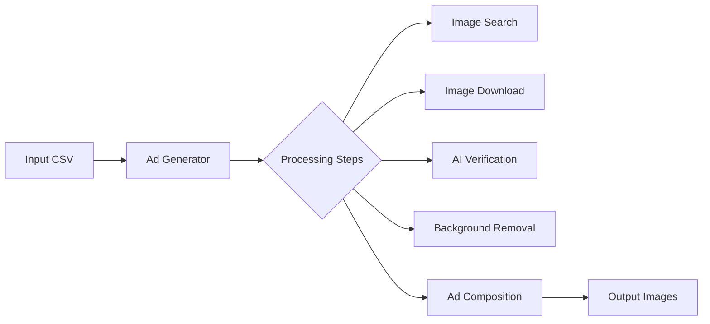
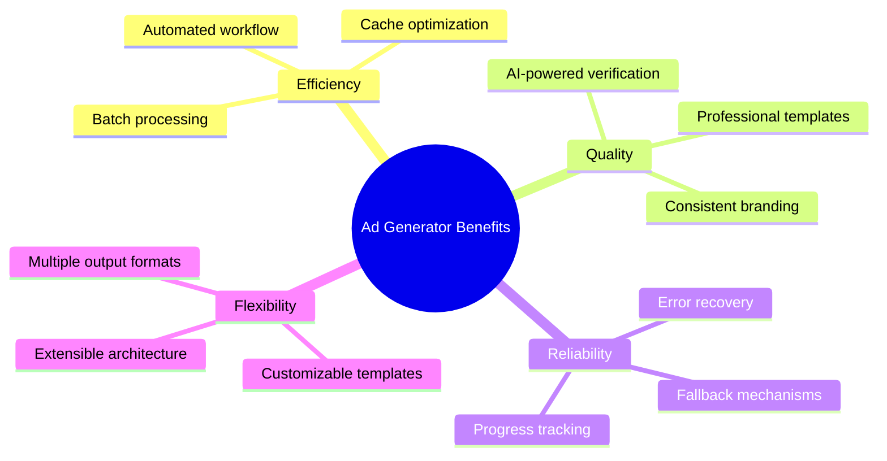

# Ad Generator - Complete Documentation

A Python application that automatically generates product advertisement images by searching for product images online, processing them with AI, and composing them into professional ad creatives.

## 🚀 Quick Start

```bash
# Install dependencies
pip install -r requirements.txt

# Run the ad generator
python main.py

# Or with custom input file
python main.py --input data/input/products.csv
```

## 📁 Project Structure

```
ad_gen/
├── main.py                 # Entry point
├── config/                 # Configuration and templates
│   ├── settings.py         # All configuration dataclasses
│   └── templates.py        # Ad layout templates
├── core/                   # Core pipeline components
│   ├── pipeline.py         # Main orchestrator
│   ├── compositor.py       # Ad image composition
│   ├── progress.py         # Progress tracking (SQLite)
│   └── health.py           # Engine health monitoring
├── search/                 # Image search engines
│   ├── base.py             # BaseSearchEngine abstract class
│   ├── manager.py          # SearchManager coordinator
│   ├── google_engine.py    # Google Images scraper
│   ├── bing_engine.py      # Bing Images scraper
│   └── duckduckgo_engine.py# DuckDuckGo Images scraper
├── imaging/                # Image processing
│   ├── downloader.py       # Image download and validation
│   ├── background.py       # Background removal (rembg)
│   ├── cache.py            # SQLite image cache
│   ├── scorer.py           # Quality scoring
│   ├── verifier.py         # CLIP/BLIP AI verification
│   ├── fonts.py            # Font management
│   └── helpers.py          # Image utilities
├── notifications/          # Notifications
│   └── notifier.py         # Webhook and email notifications
├── utils/                  # Shared utilities
│   ├── exceptions.py       # Custom exceptions
│   ├── concurrency.py      # Thread-safe primitives
│   ├── log_config.py       # Logging setup
│   ├── retry.py            # Retry decorator
│   └── text_cleaner.py     # Query cleaning
├── tests/                  # Unit tests
│   ├── test_downloader.py
│   ├── test_search.py
│   └── test_pipeline.py
├── data/                   # Data directories
│   ├── input/              # Input CSV files
│   └── output/             # Generated ads
└── docs/                   # Documentation (this folder)
```

## 🔄 Data Flow Overview

```
┌─────────────────────────────────────────────────────────────────────────────┐
│                        AD GENERATOR DATA FLOW                               │
└─────────────────────────────────────────────────────────────────────────────┘

┌─────────────┐     ┌─────────────┐     ┌─────────────┐     ┌─────────────┐
│   INPUT     │     │   SEARCH    │     │   IMAGING   │     │   OUTPUT    │
│   CSV       │     │   ENGINES   │     │   PIPELINE  │     │   ADS       │
└──────┬──────┘     └──────┬──────┘     └──────┬──────┘     └──────┬──────┘
       │                   │                   │                   │
       ▼                   ▼                   ▼                   ▼
┌─────────────┐     ┌─────────────┐     ┌─────────────┐     ┌─────────────┐
│ Product     │     │ Google      │     │ Download    │     │ Final Ad    │
│ Name,       │────►│ Bing        │────►│ Validate    │────►│ Image       │
│ Price, etc. │     │ DuckDuckGo  │     │ Verify (AI) │     │ (JPEG/PNG)  │
└─────────────┘     └─────────────┘     │ Compose     │     └─────────────┘
                                        └─────────────┘

Detailed Flow:
═════════════

1. READ CSV
   │
   ▼
2. BUILD QUERY (clean product name)
   │
   ▼
3. CHECK CACHE (skip if already processed)
   │
   ▼
4. SEARCH IMAGES (try multiple engines)
   │
   ▼
5. DOWNLOAD BEST (validate dimensions, quality)
   │
   ▼
6. VERIFY IMAGE (CLIP/BLIP AI matching)
   │
   ▼
7. REMOVE BACKGROUND (if applicable)
   │
   ▼
8. COMPOSE AD (add text, branding)
   │
   ▼
9. SAVE OUTPUT (JPEG/PNG)
   │
   ▼
10. NOTIFY (webhook/email)
```

## 🧩 Key Components

### 1. Pipeline ([`core/pipeline.py`](core/pipeline.py))

The main orchestrator that coordinates all operations:
- Reads CSV input
- Manages thread pool for parallel processing
- Tracks progress in SQLite
- Handles failures and retries

### 2. Search Engines ([`search/`](search/))

Multi-engine image search with fallback:
- Google Images (primary)
- Bing Images (fallback)
- DuckDuckGo Images (fallback)
- Automatic engine health monitoring
- Rate limiting and circuit breakers

### 3. Image Processing ([`imaging/`](imaging/))

Complete image pipeline:
- **Download**: Fetch and validate images
- **Score**: Multi-factor quality assessment
- **Verify**: AI-powered image-text matching
- **Background Removal**: rembg AI processing
- **Cache**: SQLite-based deduplication

### 4. Ad Composition ([`core/compositor.py`](core/compositor.py))

Creates final ad images:
- Applies templates
- Adds product text
- Renders gradients and shadows
- Outputs high-quality JPEG/PNG

## 📊 Processing Pipeline

```
┌─────────────────────────────────────────────────────────────────────────────┐
│                    SINGLE PRODUCT PROCESSING FLOW                           │
└─────────────────────────────────────────────────────────────────────────────┘

                    ┌─────────────────┐
                    │  CSV Row        │
                    │  (Product Data) │
                    └────────┬────────┘
                             │
                             ▼
                    ┌─────────────────┐
                    │  Build Query    │
                    │  clean_query()  │
                    └────────┬────────┘
                             │
                             ▼
                    ┌─────────────────┐
                    │  Check Cache    │
                    │  ImageCache     │
                    └────────┬────────┘
                             │
              ┌──────────────┴──────────────┐
              │                             │
              ▼                             ▼
        Cache HIT                      Cache MISS
        (Use cached)                   (Search & Download)
              │                             │
              │                             ▼
              │                    ┌─────────────────┐
              │                    │ SearchManager   │
              │                    │ .search()       │
              │                    └────────┬────────┘
              │                             │
              │                             ▼
              │                    ┌─────────────────┐
              │                    │ ImageDownloader │
              │                    │ .download_best()│
              │                    └────────┬────────┘
              │                             │
              │                             ▼
              │                    ┌─────────────────┐
              │                    │ ImageVerifier   │
              │                    │ .verify()       │
              │                    └────────┬────────┘
              │                             │
              │                             ▼
              │                    ┌─────────────────┐
              │                    │ BackgroundRemover│
              │                    │ .remove()       │
              │                    └────────┬────────┘
              │                             │
              └──────────────┬──────────────┘
                             │
                             ▼
                    ┌─────────────────┐
                    │ AdCompositor    │
                    │ .compose()      │
                    └────────┬────────┘
                             │
                             ▼
                    ┌─────────────────┐
                    │ Save to disk    │
                    │ ad_XXXX.jpg     │
                    └─────────────────┘
```

## ⚙️ Configuration

All configuration is in [`config/settings.py`](config/settings.py):

```python
# Main configuration class
@dataclass
class AppConfig:
    paths: PathConfig               # Input/output paths
    search: SearchConfig            # Search engine settings
    quality: ImageQualityConfig     # Image validation thresholds
    verification: VerificationConfig # CLIP/BLIP settings
    bg_removal: BackgroundRemovalConfig
    notifications: NotificationConfig
    pipeline: PipelineConfig        # Threading, batching
```

### Key Settings

| Setting | Default | Description |
|---------|---------|-------------|
| `max_workers` | 4 | Parallel processing threads |
| `batch_size` | 50 | Products per batch |
| `min_width` | 100 | Minimum image width (px) |
| `min_height` | 100 | Minimum image height (px) |
| `use_clip` | True | Enable CLIP verification |
| `use_blip` | True | Enable BLIP verification |

## 📖 Documentation Index

### Core Documentation
- [Main Entry Point](main.md) - Application startup
- [Configuration](config/settings.md) - All settings explained
- [Ad Templates](config/templates.md) - Layout templates

### Pipeline Documentation
- [Pipeline](core/pipeline.md) - Main orchestrator
- [Compositor](core/compositor.md) - Ad composition
- [Progress Manager](core/progress.md) - SQLite progress tracking
- [Health Monitor](core/health.md) - Engine health

### Search Documentation
- [Base Engine](search/base.md) - Abstract base class
- [Search Manager](search/manager.md) - Multi-engine coordination
- [Search Engines](search/engines.md) - Google, Bing, DuckDuckGo

### Imaging Documentation
- [Imaging Overview](imaging/overview.md) - Module overview
- [Downloader](imaging/downloader.md) - Image downloading
- [Image Cache](imaging/cache.md) - SQLite caching
- [Quality Scorer](imaging/scorer.md) - Multi-factor scoring
- [Image Verifier](imaging/verifier.md) - CLIP/BLIP verification
- [Background Removal](imaging/background.md) - rembg processing
- [Font Manager](imaging/fonts.md) - Font loading
- [Image Helpers](imaging/helpers.md) - Utility functions

### Utils Documentation
- [Utils Overview](utils/overview.md) - Module overview
- [Concurrency](utils/concurrency.md) - Thread-safe primitives
- [Exceptions](utils/exceptions.md) - Custom errors
- [Retry Decorator](utils/retry.md) - Automatic retry
- [Logging](utils/log-config.md) - Centralized logging
- [Text Cleaner](utils/text-cleaner.md) - Query cleaning

### Other
- [Notifier](notifications/notifier.md) - Webhook/email notifications
- [Tests](tests/overview.md) - Unit tests

## 🔧 Requirements

```
Python >= 3.10
Pillow >= 10.0.0
requests >= 2.28.0
pandas >= 2.0.0
numpy >= 1.24.0
rembg >= 2.0.50
transformers >= 4.30.0
torch >= 2.0.0
```

See [`requirements.txt`](../requirements.txt) for complete list.

## 📝 Input Format

The application expects a CSV file with product data:

```csv
Product Name,Price,Category,Description
"Red Nike Shoes",$99.99,Footwear,"Running shoes"
"Blue T-Shirt",$29.99,Clothing,"Cotton t-shirt"
```

**Required Columns** (configurable):
- `Product Name` or `Title` - Used for image search
- Any additional columns for ad text

## 📂 Output

Generated ads are saved to `data/output/images/`:

```
data/output/
├── Train.csv           # Updated CSV with results
└── images/
    ├── ad_0001.jpg     # Generated ad images
    ├── ad_0002.jpg
    └── ...
```

## 🧪 Running Tests

```bash
# Run all tests
pytest tests/

# Run with coverage
pytest tests/ --cov=. --cov-report=html

# Run specific test file
pytest tests/test_downloader.py -v
```

## 📞 Support

For issues or questions:
1. Check the [documentation index](#📖-documentation-index)
2. Review the relevant module documentation
3. Check logs in `data/adgen.log`

---


<!-- VISUAL ENHANCEMENTS BELOW -->

## 📊 System Overview (Mermaid)




## 🎯 Key Benefits Visualization



## 🛠️ Quick Setup Checklist

<div style="background-color: #e8f4fd; padding: 15px; border-left: 5px solid #4285f4; margin: 20px 0;">
<strong>📋 Prerequisites</strong><br>
✅ Python 3.10+ installed<br>
✅ pip package manager available<br>
✅ At least 2GB free disk space<br>
✅ Internet connectivity for image search
</div>

<div style="background-color: #e8fdf5; padding: 15px; border-left: 5px solid #0f9d58; margin: 20px 0;">
<strong>🚀 Installation Steps</strong><br>
1. Clone repository<br>
2. Install dependencies: <code>pip install -r requirements.txt</code><br>
3. Prepare input CSV in <code>data/input/</code><br>
4. Run: <code>python main.py</code><br>
5. Collect outputs from <code>data/output/</code>
</div>
