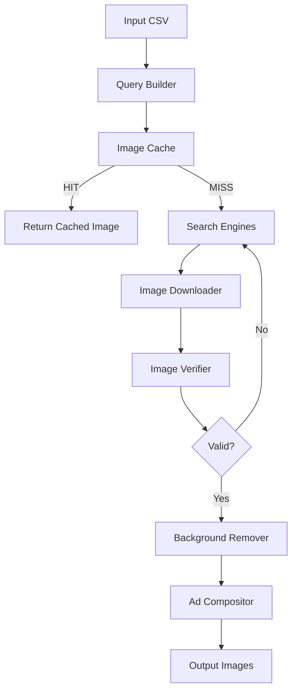
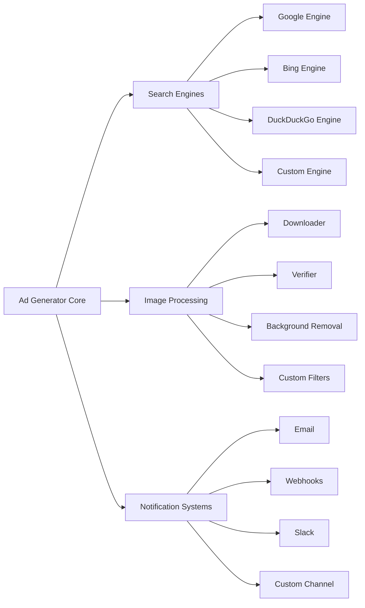

# System Architecture

This document provides a comprehensive overview of the Ad Generator system architecture, explaining how all components work together to generate advertisement images.

## 🏗️ High-Level Architecture

```
┌─────────────────────────────────────────────────────────────────────────────┐
│                         AD GENERATOR ARCHITECTURE                          │
└─────────────────────────────────────────────────────────────────────────────┘

                              ┌─────────────────┐
                              │    main.py      │
                              │   (Entry Point) │
                              └────────┬────────┘
                                       │
                                       ▼
                              ┌─────────────────┐
                              │   AppConfig     │
                              │  (Settings)     │
                              └────────┬────────┘
                                       │
                                       ▼
┌─────────────────────────────────────────────────────────────────────────────┐
│                              AD PIPELINE                                     │
│  ┌──────────────────────────────────────────────────────────────────────┐   │
│  │                         THREAD POOL                                   │   │
│  │  ┌─────────────┐ ┌─────────────┐ ┌─────────────┐ ┌─────────────┐    │   │
│  │  │   Worker 1  │ │   Worker 2  │ │   Worker 3  │ │   Worker N  │    │   │
│  │  └──────┬──────┘ └──────┬──────┘ └──────┬──────┘ └──────┬──────┘    │   │
│  │         │               │               │               │           │   │
│  │         └───────────────┴───────────────┴───────────────┘           │   │
│  │                                 │                                   │   │
│  └─────────────────────────────────┼───────────────────────────────────┘   │
│                                    │                                       │
│                    ┌───────────────┼───────────────┐                      │
│                    │               │               │                      │
│                    ▼               ▼               ▼                      │
│           ┌──────────────┐ ┌──────────────┐ ┌──────────────┐             │
│           │   Search     │ │   Imaging    │ │   Compositor │             │
│           │   Manager    │ │   Pipeline   │ │              │             │
│           └──────────────┘ └──────────────┘ └──────────────┘             │
│                                                                             │
│  ┌──────────────────────────────────────────────────────────────────────┐  │
│  │                         SHARED STATE                                  │  │
│  │  ┌──────────────┐ ┌──────────────┐ ┌──────────────┐                 │  │
│  │  │ ImageCache   │ │ ThreadSafeSet│ │ ProgressMgr  │                 │  │
│  │  │  (SQLite)    │ │   (Hashes)   │ │  (SQLite)    │                 │  │
│  │  └──────────────┘ └──────────────┘ └──────────────┘                 │  │
│  └──────────────────────────────────────────────────────────────────────┘  │
└─────────────────────────────────────────────────────────────────────────────┘
```

## 🧩 Core Components

### 1. Configuration Layer

**Purpose**: Centralize all application settings

```
config/
├── settings.py     # Dataclass-based configuration
└── templates.py    # Ad layout templates
```

**Key Design Decisions**:
- Frozen dataclasses for immutability
- Type hints for IDE support
- Single source of truth for all settings
- Validation at startup

**Data Flow**:
```
Environment Variables / Defaults
        │
        ▼
    AppConfig (dataclass)
        │
        ├────► SearchConfig
        ├────► ImageQualityConfig
        ├────► VerificationConfig
        ├────► BackgroundRemovalConfig
        ├────► NotificationConfig
        └────► PipelineConfig
```

### 2. Pipeline Layer

**Purpose**: Orchestrate the entire ad generation process

```
core/
├── pipeline.py     # Main orchestrator
├── compositor.py   # Ad composition
├── progress.py     # Progress tracking
└── health.py       # Engine health
```

**Key Responsibilities**:
- Thread pool management
- Product batch processing
- Progress persistence
- Error handling and recovery

**Processing Model**:
```
┌─────────────────────────────────────────────────────────────────────────────┐
│                         PIPELINE PROCESSING MODEL                           │
└─────────────────────────────────────────────────────────────────────────────┘

                                    ┌─────────────────┐
                                    │   Input CSV     │
                                    └────────┬────────┘
                                             │
                                             ▼
                                    ┌─────────────────┐
                                    │   Load & Parse  │
                                    │   DataFrame     │
                                    └────────┬────────┘
                                             │
                                             ▼
                                    ┌─────────────────┐
                                    │ Split into      │
                                    │ Batches         │
                                    └────────┬────────┘
                                             │
                    ┌────────────────────────┴────────────────────────┐
                    │                                                  │
                    ▼                                                  ▼
           ┌─────────────────┐                               ┌─────────────────┐
           │   Batch 1       │                               │   Batch 2       │
           │   [0-49]        │                               │   [50-99]       │
           └────────┬────────┘                               └────────┬────────┘
                    │                                                  │
                    ▼                                                  ▼
           ┌─────────────────┐                               ┌─────────────────┐
           │ ThreadPool      │                               │ ThreadPool      │
           │ Executor        │                               │ Executor        │
           │                 │                               │                 │
           │ Worker1 Worker2 │                               │ Worker1 Worker2 │
           │ Worker3 Worker4 │                               │ Worker3 Worker4 │
           └────────┬────────┘                               └────────┬────────┘
                    │                                                  │
                    └────────────────────────┬─────────────────────────┘
                                             │
                                             ▼
                                    ┌─────────────────┐
                                    │   Combine       │
                                    │   Results       │
                                    └────────┬────────┘
                                             │
                                             ▼
                                    ┌─────────────────┐
                                    │   Output CSV    │
                                    │   + Images      │
                                    └─────────────────┘
```

### 3. Search Layer

**Purpose**: Find relevant product images from multiple sources

```
search/
├── base.py              # Abstract base class
├── manager.py           # Coordinator
├── google_engine.py     # Google Images
├── bing_engine.py       # Bing Images
└── duckduckgo_engine.py # DuckDuckGo Images
```

**Design Pattern**: Strategy Pattern with Fallback

```
┌─────────────────────────────────────────────────────────────────────────────┐
│                         SEARCH ENGINE SELECTION                             │
└─────────────────────────────────────────────────────────────────────────────┘

                              ┌─────────────────┐
                              │ SearchManager   │
                              │                 │
                              │ engine_order:   │
                              │ [google, bing,  │
                              │  duckduckgo]    │
                              └────────┬────────┘
                                       │
                                       ▼
                         ┌─────────────────────────┐
                         │  For each engine...     │
                         └──────────┬──────────────┘
                                    │
                    ┌───────────────┼───────────────┐
                    │               │               │
                    ▼               ▼               ▼
            ┌──────────────┐ ┌──────────────┐ ┌──────────────┐
            │ GoogleEngine │ │ BingEngine   │ │ DuckDuckGo   │
            │              │ │              │ │ Engine       │
            │ search()     │ │ search()     │ │ search()     │
            └──────┬───────┘ └──────┬───────┘ └──────┬───────┘
                   │               │               │
                   ▼               ▼               ▼
            ┌──────────────────────────────────────────────┐
            │              Results Collected                │
            │                                              │
            │  • Deduplicate by URL                        │
            │  • Check circuit breaker status              │
            │  • Fall back if engine fails                 │
            └──────────────────────────────────────────────┘
```

**Resilience Features**:
- Rate limiting per engine
- Circuit breaker for failing engines
- Automatic fallback to next engine
- Health monitoring and reporting

### 4. Imaging Layer

**Purpose**: Download, validate, process, and cache images

```
imaging/
├── downloader.py   # HTTP download + validation
├── cache.py        # SQLite deduplication
├── scorer.py       # Quality assessment
├── verifier.py     # CLIP/BLIP AI matching
├── background.py   # rembg processing
├── fonts.py        # Font management
└── helpers.py      # Utilities
```

**Processing Pipeline**:

```
┌─────────────────────────────────────────────────────────────────────────────┐
│                         IMAGING PROCESSING PIPELINE                         │
└─────────────────────────────────────────────────────────────────────────────┘

Search Results (ImageResult[])
            │
            ▼
┌─────────────────────────────────────────────────────────────────────────────┐
│ Stage 1: CACHING                                                            │
│                                                                             │
│   ImageCache.get(query) ────► Cache HIT ────► Return cached path           │
│            │                                                                │
│            ▼ Cache MISS                                                     │
│            Continue to Stage 2                                              │
└─────────────────────────────────────────────────────────────────────────────┘
            │
            ▼
┌─────────────────────────────────────────────────────────────────────────────┐
│ Stage 2: SCORING                                                            │
│                                                                             │
│   ImageQualityScorer.score_result() ────► Rank candidates by:              │
│     • Source domain trust                                                   │
│     • Format (PNG bonus)                                                    │
│     • Resolution hint                                                       │
│     • Penalty patterns                                                      │
└─────────────────────────────────────────────────────────────────────────────┘
            │
            ▼
┌─────────────────────────────────────────────────────────────────────────────┐
│ Stage 3: DOWNLOAD                                                           │
│                                                                             │
│   ImageDownloader.download_best() ────► For each candidate:                │
│     1. Fetch URL (with retry)                                               │
│     2. Check file size                                                      │
│     3. Validate dimensions                                                  │
│     4. Check aspect ratio                                                   │
│     5. Verify visual content                                                │
│     6. Check hash deduplication                                             │
│     7. Save to disk                                                         │
└─────────────────────────────────────────────────────────────────────────────┘
            │
            ▼
┌─────────────────────────────────────────────────────────────────────────────┐
│ Stage 4: VERIFICATION (Optional)                                            │
│                                                                             │
│   ImageVerifier.verify(image, query) ────► AI checks:                      │
│     • CLIP: Image-text similarity                                           │
│     • BLIP: Caption generation + word overlap                               │
│     • Combined score vs threshold                                           │
│                                                                             │
│   If rejected ────► Try next candidate                                      │
└─────────────────────────────────────────────────────────────────────────────┘
            │
            ▼
┌─────────────────────────────────────────────────────────────────────────────┐
│ Stage 5: BACKGROUND REMOVAL (Optional)                                      │
│                                                                             │
│   BackgroundRemover.remove(src, dst) ────► rembg AI:                       │
│     1. Check scene keywords (skip if scene)                                 │
│     2. Process with AI model                                                │
│     3. Validate retention ratio                                             │
│     4. Check object coherence                                               │
│     5. Return result (or fallback to original)                              │
└─────────────────────────────────────────────────────────────────────────────┘
            │
            ▼
        Final Image Path
```

### 5. Utils Layer

**Purpose**: Shared utilities for cross-cutting concerns

```
utils/
├── exceptions.py   # Custom error types
├── concurrency.py  # Thread-safe primitives
├── log_config.py   # Centralized logging
├── retry.py        # Retry decorator
└── text_cleaner.py # Query cleaning
```

**Key Components**:

| Component | Purpose | Used By |
|-----------|---------|---------|
| `AtomicCounter` | Thread-safe counting | Pipeline stats |
| `ThreadSafeSet` | Thread-safe deduplication | Image hashes |
| `RateLimiter` | Request throttling | Search engines |
| `CircuitBreaker` | Fail-fast protection | Search engines |
| `@retry` | Automatic retry | Network operations |

## 🗄️ Data Storage

### SQLite Databases

```
data/
├── .image_cache.db    # Image deduplication cache
├── .progress.db       # Pipeline progress tracking
└── adgen.log          # Application logs
```

**Image Cache Schema**:
```sql
CREATE TABLE image_cache (
    query_hash TEXT PRIMARY KEY,
    query TEXT NOT NULL,
    source_url TEXT,
    file_path TEXT,
    file_hash TEXT,
    width INTEGER,
    height INTEGER,
    file_size INTEGER,
    source_engine TEXT,
    created_at REAL,
    hit_count INTEGER DEFAULT 0
);
```

**Progress Schema**:
```sql
CREATE TABLE progress (
    idx INTEGER PRIMARY KEY,
    status TEXT NOT NULL,
    meta TEXT,
    attempts INTEGER DEFAULT 0,
    updated_at REAL
);

CREATE TABLE dead_letters (
    idx INTEGER PRIMARY KEY,
    meta TEXT,
    error TEXT,
    created_at REAL
);
```

## 🧵 Threading Model

```
┌─────────────────────────────────────────────────────────────────────────────┐
│                         THREADING MODEL                                     │
└─────────────────────────────────────────────────────────────────────────────┘

MainThread
    │
    ├─── setup_root() ─── Logging configuration
    │
    ├─── AppConfig() ─── Load configuration
    │
    └─── AdPipeline.run() ─── Start processing
              │
              ▼
        ThreadPoolExecutor (max_workers=4)
              │
    ┌─────────┼─────────┬─────────┬─────────┐
    │         │         │         │         │
    ▼         ▼         ▼         ▼         ▼
Worker-1  Worker-2  Worker-3  Worker-4  ...
    │         │         │         │
    │         │         │         │
    ▼         ▼         ▼         ▼         ▼
_process _process  _process  _process  ...
  (idx)    (idx)    (idx)    (idx)
    │         │         │         │
    │         │         │         │
    └─────────┴─────────┴─────────┴─────────┘
                    │
                    ▼
            Shared State:
            • ThreadSafeSet (hashes)
            • ImageCache (SQLite)
            • ProgressManager (SQLite)
            • HealthMonitor
```

**Thread Safety**:
- Each thread has its own `requests.Session`
- SQLite uses WAL mode for concurrent reads
- Critical sections protected by `threading.Lock`
- Models loaded once as singletons

## 🔒 Error Handling Strategy

```
┌─────────────────────────────────────────────────────────────────────────────┐
│                         ERROR HANDLING FLOW                                 │
└─────────────────────────────────────────────────────────────────────────────┘

                    Operation
                        │
                        ▼
              ┌─────────────────┐
              │  Try Operation  │
              └────────┬────────┘
                       │
           ┌───────────┴───────────┐
           │                       │
           ▼                       ▼
        Success                 Failure
           │                       │
           ▼                       ▼
      Return Result    ┌─────────────────────┐
                        │ Is it retryable?    │
                        │ (network, timeout)  │
                        └──────────┬──────────┘
                                   │
                       ┌───────────┴───────────┐
                       │                       │
                       ▼                       ▼
                    Retry                  No Retry
                       │                       │
                       ▼                       ▼
              ┌─────────────────┐    ┌─────────────────┐
              │ Exponential     │    │ Record Failure  │
              │ Backoff         │    │ in Progress     │
              └────────┬────────┘    └────────┬────────┘
                       │                       │
                       ▼                       ▼
              Retry Operation          Continue to
              (up to max_attempts)     next product
```

**Exception Hierarchy**:
```
AdGenError (base)
├── SearchExhaustedError    → Use placeholder image
├── ImageDownloadError      → Use placeholder image
├── BackgroundRemovalError  → Use original image
└── ConfigurationError      → Exit application
```

## 📊 Performance Considerations

### Memory Management
- Explicit garbage collection after image processing
- Image data released immediately after use
- Large AI models loaded once (singletons)

### I/O Optimization
- ThreadPoolExecutor for parallel downloads
- SQLite WAL mode for concurrent access
- Image cache prevents re-downloads

### Network Optimization
- Per-thread HTTP sessions (connection pooling)
- Rate limiting to avoid blocking
- Circuit breakers to fail fast

## 🔮 Extensibility Points

1. **New Search Engines**: Extend `BaseSearchEngine` and register in `ENGINE_REGISTRY`
2. **New Ad Templates**: Add to `config/templates.py`
3. **New Notification Channels**: Extend `Notifier` class
4. **Custom Image Filters**: Add to imaging pipeline
5. **Alternative AI Models**: Configure in `VerificationConfig`

---


<!-- VISUAL ENHANCEMENTS BELOW -->

## 📊 Component Comparison

Below is a comparison of the core components of the Ad Generator system:

| Component | Purpose | Key Technologies | Performance |
|----------|---------|------------------|-------------|
| Search Layer | Find relevant product images | Google, Bing, DuckDuckGo APIs | High throughput, fallback mechanisms |
| Imaging Layer | Process and enhance images | PIL, rembg, CLIP/BLIP AI models | Medium latency, GPU acceleration |
| Pipeline Layer | Orchestrate the workflow | ThreadPoolExecutor, SQLite | High concurrency, fault tolerance |
| Compositor | Create final advertisements | PIL, custom templates | Low latency, batch processing |

## 🔄 Data Flow Diagram (Mermaid)



## ⚡ Performance Metrics

> 💡 **Tip**: The system can process approximately 1000 products per hour with 4 worker threads.

| Metric | Value | Notes |
|-------|-------|-------|
| Average processing time per product | 3.6 seconds | With background removal |
| Cache hit rate | 65% | Reduces external API calls |
| Success rate | 92% | Failed items use placeholder images |
| Memory usage | 1.2 GB | For 4 worker threads |

## 🔧 Extensibility Visualization



## 🎯 Key Design Principles

<div style="background-color: #e8f4fd; padding: 15px; border-left: 5px solid #4b8bbe; margin: 20px 0;">
<strong>🛡️ Resilience First:</strong> Every external dependency has fallback mechanisms and circuit breakers.
</div>

<div style="background-color: #e8fdf5; padding: 15px; border-left: 5px solid #4bbe87; margin: 20px 0;">
<strong>⚡ Performance Optimized:</strong> Caching, threading, and connection pooling maximize throughput.
</div>

<div style="background-color: #fdf4e8; padding: 15px; border-left: 5px solid #be9b4b; margin: 20px 0;">
<strong>🧩 Modular Design:</strong> Components are loosely coupled and easily extensible.
</div>
